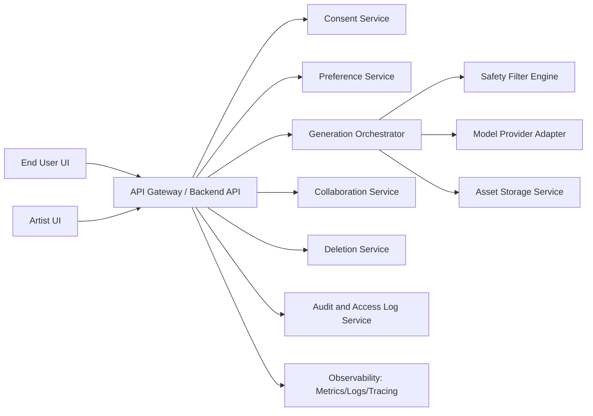
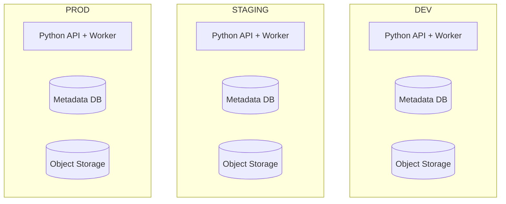

# Software Design Description (SDD)

Project: ReSkin AI  
Primary language: Python  
Version: 1.0  
Date: 2026-02-12  
Owner: Founder / Engineering Lead

ReSkin AI is operated as a safety-critical identity product.  
This design prioritizes privacy, emotional safety, and auditable behavior.

## 1. Purpose and Scope

### 1.1 Purpose
This SDD describes the technical design that implements the requirements defined in `docs/srs/SRS.md`.

### 1.2 Scope
This document covers:
- System architecture and component decomposition.
- API and data design for MVP/pilot stage.
- Safety, privacy, and reliability design controls.
- Deployment, observability, and operational hooks.

## 2. Design Drivers

### 2.1 Primary drivers
- `SRS FR-001..FR-036` functional coverage.
- `SRS NFR-001..NFR-018` quality constraints.
- SCMP controls for environment isolation, incidents, and model governance.

### 2.2 Key constraints
- Python-first implementation.
- Managed model APIs in MVP stage.
- Strict environment separation (`dev/staging/prod`).
- Small team, high compliance sensitivity.

## 3. System Context and Architecture

### 3.1 Context view
- End User interacts with web client.
- Tattoo Artist interacts with artist workspace.
- Backend API orchestrates business logic.
- AI provider generates concept images.
- Secure storage persists uploads and outputs.
- Observability stack captures metrics/logs/traces.

### 3.2 Logical architecture



### 3.3 Deployment topology (MVP)



Environment resources are isolated and never shared directly.

## 4. Technology Stack

### 4.1 Backend
- Python 3.11+
- FastAPI (recommended) for versioned REST APIs
- Pydantic models for schema validation
- SQLAlchemy (or equivalent ORM) for metadata persistence
- Celery/RQ/async worker for generation and deletion jobs

### 4.2 Data and storage
- Relational DB for metadata and audit events
- Encrypted object storage for uploads/concepts
- Optional Redis for queue/cache use

### 4.3 Quality and operations
- Pytest, Ruff, optional Mypy
- OpenTelemetry-compatible logs/metrics/traces
- CI gates aligned with SCMP

## 5. Component Design

Component IDs use `CMP-##`.

## 5.1 API Gateway and Auth Layer (`CMP-01`)

Responsibilities:
- Route `/api/v1/*` requests.
- Enforce authentication and RBAC.
- Apply request-level validation and rate limits.

Key SRS mapping:
- FR-004, FR-022, FR-026, FR-032
- NFR-006, NFR-007

Interfaces:
- `POST /api/v1/auth/session`
- `GET /api/v1/users/me`
- Shared auth middleware and permission checks

## 5.2 Consent Service (`CMP-02`)

Responsibilities:
- Capture consent and disclaimer acceptance.
- Version consent policy references.
- Provide consent verification for upload/generation requests.

Key SRS mapping:
- FR-001, FR-002, FR-011
- NFR-011

Data owned:
- `consent_records`

## 5.3 Preference Service (`CMP-03`)

Responsibilities:
- Manage user style/motif/avoid-list profile.
- Version preferences by generation attempt.

Key SRS mapping:
- FR-006, FR-007, FR-008

## 5.4 Asset Ingestion Service (`CMP-04`)

Responsibilities:
- Validate and ingest user-uploaded images.
- Run malware/format checks.
- Attach consent and actor metadata.

Key SRS mapping:
- FR-009, FR-010, FR-011, FR-012
- NFR-005

## 5.5 Generation Orchestrator (`CMP-05`)

Responsibilities:
- Build generation request payload from preferences + image.
- Execute policy checks and request model provider adapter.
- Apply retry and failure policy.
- Persist generation metadata and output references.

Key SRS mapping:
- FR-013, FR-014, FR-016, FR-017, FR-035
- NFR-001, NFR-002, NFR-003

## 5.6 Safety Filter Engine (`CMP-06`)

Responsibilities:
- Prompt pre-filtering and output post-filtering.
- Block unsafe classes and emit safety events.
- Provide rule IDs and severity tags for audit.

Key SRS mapping:
- FR-015, FR-028, FR-029
- NFR-009, NFR-010

## 5.7 Concept Management Service (`CMP-07`)

Responsibilities:
- Save and retrieve concept sets.
- Collect likes/dislikes/reason tags.
- Support comparison and handoff candidate selection.

Key SRS mapping:
- FR-018, FR-019, FR-020, FR-021

## 5.8 Collaboration Service (`CMP-08`)

Responsibilities:
- Create and manage artist handoff permissions.
- Render artist workspace with user-approved artifacts.
- Track feedback and collaboration history.
- Enforce user-driven access revocation.

Key SRS mapping:
- FR-022, FR-023, FR-024, FR-025, FR-026

## 5.9 Privacy and Deletion Service (`CMP-09`)

Responsibilities:
- Execute user data deletion requests.
- Apply retention policy enforcement.
- Verify storage and metadata deletion completion.

Key SRS mapping:
- FR-030, FR-033
- NFR-005

## 5.10 Audit and Access Log Service (`CMP-10`)

Responsibilities:
- Log sensitive data access events.
- Log policy events and incident tags.
- Support investigation and compliance reporting.

Key SRS mapping:
- FR-029, FR-032, FR-036
- NFR-007, NFR-018

## 5.11 Operations Control Service (`CMP-11`)

Responsibilities:
- Provide admin controls to disable generation route/model path.
- Surface operational metrics and health states.
- Tag/track incident severity and lifecycle.

Key SRS mapping:
- FR-034, FR-035, FR-036
- NFR-010

## 6. Data Design

### 6.1 Core schema (logical)

```text
users(id, role, pseudonymous_id, locale, created_at)
artists(id, profile_status, created_at)
consent_records(id, user_id, policy_version, accepted_at, disclaimer_accepted)
uploaded_images(id, user_id, consent_id, storage_uri, checksum, created_at, expires_at)
preferences(id, user_id, version, style_json, avoid_json, created_at)
generation_requests(id, user_id, preference_id, image_id, status, created_at, completed_at)
generation_metadata(id, request_id, model_version, prompt_hash, safety_policy_version, latency_ms)
concept_assets(id, request_id, storage_uri, ranking, created_at)
concept_feedback(id, concept_id, user_id, sentiment, reason_tags, created_at)
artist_access(id, user_id, artist_id, status, granted_at, revoked_at)
collaboration_notes(id, artist_id, user_id, concept_id, note_text, created_at)
deletion_requests(id, user_id, status, requested_at, completed_at)
safety_events(id, actor_id, request_id, rule_id, severity, action, created_at)
audit_events(id, actor_id, resource_type, resource_id, action, created_at, trace_id)
incidents(id, severity, status, summary, opened_at, closed_at)
```

### 6.2 Data lifecycle
- Upload and concept assets follow retention policy with expiry.
- Deletion request triggers async hard-delete workflow.
- Audit and safety event retention follows compliance policy.

### 6.3 Data access patterns
- Read-heavy: concept retrieval and collaboration views.
- Write-heavy bursts: generation and feedback sessions.
- Sensitive path reads always emit audit events.

## 7. API Design (MVP)

### 7.1 Endpoint groups
- Auth/session:
  - `POST /api/v1/auth/session`
- Consent:
  - `POST /api/v1/consents`
  - `GET /api/v1/consents/{id}`
- Upload:
  - `POST /api/v1/uploads`
- Preferences:
  - `POST /api/v1/preferences`
  - `PUT /api/v1/preferences/{id}`
- Generation:
  - `POST /api/v1/generations`
  - `GET /api/v1/generations/{id}`
  - `GET /api/v1/generations/{id}/concepts`
- Feedback and selection:
  - `POST /api/v1/concepts/{id}/feedback`
  - `POST /api/v1/concepts/{id}/select`
- Collaboration:
  - `POST /api/v1/collaborations/invite`
  - `POST /api/v1/collaborations/{id}/notes`
  - `POST /api/v1/collaborations/{id}/revoke`
- Deletion:
  - `POST /api/v1/deletions`
  - `GET /api/v1/deletions/{id}`
- Admin operations:
  - `POST /api/v1/admin/generation/disable`
  - `GET /api/v1/admin/metrics`

### 7.2 Error model
- Standard response:
  - `code`
  - `message`
  - `trace_id`
  - `details`
- Common error categories:
  - `CONSENT_REQUIRED`
  - `UNAUTHORIZED`
  - `FORBIDDEN`
  - `VALIDATION_ERROR`
  - `SAFETY_BLOCKED`
  - `GENERATION_FAILED`
  - `DELETION_IN_PROGRESS`

## 8. Key Runtime Flows

### 8.1 Upload to concept generation flow
1. User accepts disclaimer and consent.
2. User uploads image and provides preferences.
3. System validates upload and links consent.
4. Orchestrator requests safety pre-check.
5. Model provider generates concepts.
6. Safety post-check runs on outputs.
7. Metadata and concept assets saved.
8. User sees results and optionally submits feedback.

### 8.2 User-to-artist collaboration flow
1. User selects concepts for handoff.
2. User grants artist access.
3. Artist reviews approved concepts and adds notes.
4. User reviews feedback and may revoke access.
5. All access and edits are logged.

### 8.3 Deletion flow
1. User requests deletion.
2. System creates deletion job and marks pending.
3. Worker deletes object storage assets and metadata links.
4. System updates status and emits completion record.

## 9. Safety, Security, and Privacy Design

### 9.1 Security controls
- RBAC on all protected resources.
- Signed URLs for media access where applicable.
- Secret store required for credentials.
- TLS in transit and encryption at rest.

### 9.2 Privacy controls
- Consent-gated upload and generation.
- Data minimization in logs.
- Configurable retention and deletion pipeline.
- Environment isolation to prevent cross-environment leakage.

### 9.3 Safety controls
- Prompt and output moderation layers.
- Rule-based blocking with explainable event logging.
- Admin kill switch for unsafe model routes.

## 10. Reliability and Performance Design

### 10.1 SLO alignment
- Availability target >= 99.5%.
- P95 generation latency < 12s.
- One automatic retry on generation failure.

### 10.2 Reliability mechanisms
- Timeout and retry wrappers on external model calls.
- Idempotency keys for generation and deletion requests.
- Circuit breaker behavior for unstable provider responses.

### 10.3 Failure modes and handling
- Provider timeout: retry once, then structured failure.
- Safety block: return safe fallback message and log event.
- Storage write failure: mark partial failure and queue retry task.

## 11. Observability and Incident Hooks

### 11.1 Metrics
- Request count, error rate, latency percentiles.
- Generation success/failure ratio.
- Safety-block rate and categories.
- Deletion completion SLA.

### 11.2 Logs and tracing
- Structured logs with `trace_id`.
- Correlated traces across API, orchestrator, and worker.
- Sensitive fields redacted in logs.

### 11.3 Incident integration
- Events can be escalated to `SEV0..SEV3`.
- Incident records link to audit/safety events and deployment version.

## 12. Environment and Deployment Design

### 12.1 Environment strategy
- `DEV`: synthetic data only, fast iteration.
- `STAGING`: production-like validation, no raw production user data.
- `PROD`: restricted access and audited deploy only.

### 12.2 Promotion pipeline
- CI verifies lint/tests/security checks.
- Deployment promotions only via approved path `dev -> staging -> prod`.
- Production deploy requires release checklist pass.

## 13. Design for Testability

### 13.1 Test seams
- Provider adapter interface mockable for deterministic tests.
- Safety engine rules independently testable.
- Deletion and retention jobs testable via queue simulation.

### 13.2 Test coverage focus
- Consent gate and access control paths.
- Safety blocking behavior.
- Collaboration permission revocation.
- Deletion correctness and auditability.

## 14. Requirement-to-Component Traceability

See `docs/sdd/COMPONENT_TRACEABILITY_MATRIX.md`.

## 15. Open Design Decisions

- Final DB engine and migration tooling selection.
- Exact queue/worker framework selection.
- Region-specific compliance additions for launch market.
- Model failover provider strategy for production scale.

## 16. Future Extension Notes (Post-MVP)

- Feature flags for experimentation and safer rollout.
- Advanced personalization with user-approved style embeddings.
- Expanded artist tooling and scheduling integration.
- Billing and partner marketplace support.

